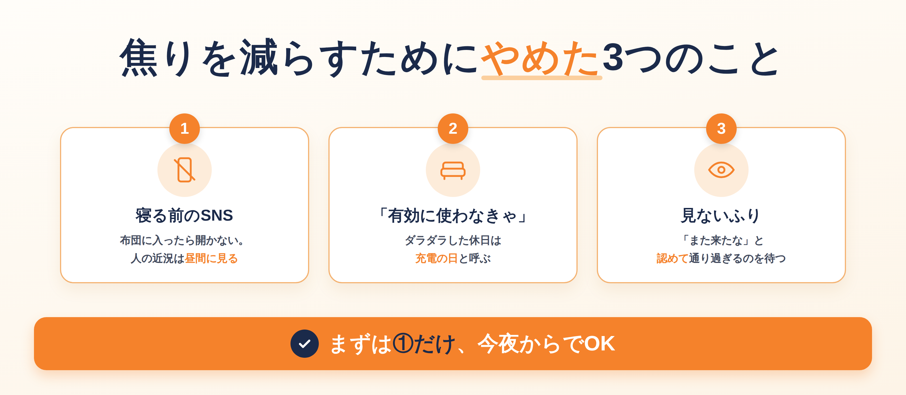
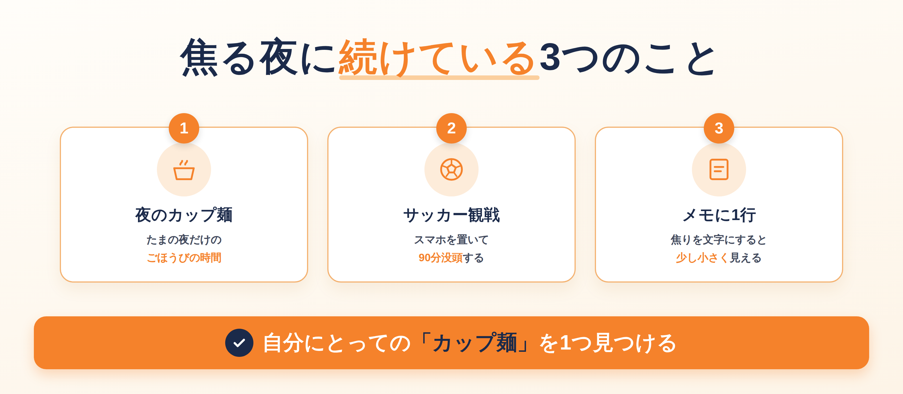
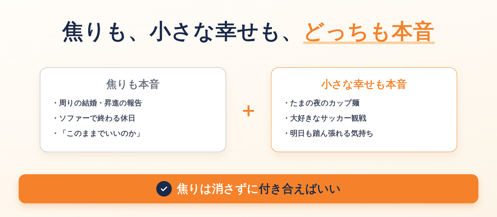

日曜の夜、なんとなくスマホを開く。

タイムラインには、友だちの結婚報告。元同期の昇進。新居の写真。
どれもめでたい話なのに、画面を閉じたあと、胸のあたりがざわざわする。

**「俺、このままでいいのかな」**

20代後半になってから、この気持ちがふいにやってくるようになった。昼間は平気なのに、決まって夜に来る。

別に、今の生活に大きな不満があるわけじゃない。仕事もあるし、ごはんも食べられている。
なのに、周りと比べた瞬間、自分だけ止まっているような気がしてくる。

この記事では、そんな夜との付き合い方として、**俺がやめた3つのこと**と、**続けている3つのこと**を書いてみる。

焦りが消えるわけじゃない。ただ、焦りに飲み込まれずに眠れる夜が、少しずつ増えてきた。

全部まねしなくていい。どれか1つ、「これならできそう」と思えるものを拾ってもらえたら、それで十分だ。

## 「このままでいいのかな」は、なぜ夜に来るのか

### 報告ラッシュと、ソファーから動けない休日

20代後半って、周りが一気に動き出す時期だと思う。

結婚、昇進、転職、引っ越し。
報告が届くたびに「おめでとう」と返しながら、自分の足元を見てしまう。

俺の休日はというと、動画を流しっぱなしにして、ソファーから動けないまま終わることが多い。
気づけば外は暗くなっていて、「今日、何してたんだっけ」となる。

そして夜。静かになった部屋で、あの問いがやってくる。

「みんなはちゃんと前に進んでいるのに、俺は何をしてるんだろう」
一度考え始めると、昔の選択まで掘り返して、気づけば日付が変わっている。そんな夜が何度もあった。

### 焦るのは、ちゃんと生きようとしている証拠

昼間は仕事や用事で頭が埋まっているから、考える隙間がない。
夜になって手が空くと、その隙間に焦りが入り込んでくるんだと思う。

でも、よく考えると、焦るのは「このままじゃ嫌だ」と思っている証拠でもある。
どうでもよければ、そもそも焦らない。
焦りの正体は、「もっと良くなりたい」という気持ちの裏返しなのかもしれない。

**焦っている自分を、責めなくていい。**
まずはそれだけ覚えておいてほしい。

## 俺がやめた3つのこと

焦りを減らすために、何かを足すより先に、いくつか「やめる」ことにした。

### ① 寝る前に、人の近況を見るのをやめた

一番効いたのがこれだった。

布団の中でSNSを開くと、他人のいちばん良い瞬間ばかりが目に入る。
しかも夜は、自分の弱いところも一緒に思い出してしまう。比べるには最悪の時間帯だ。

なので、布団に入ったらSNSは開かない、と決めた。
完璧には守れていない。それでも、開く回数が減っただけで、夜のざわざわはだいぶ小さくなった。

人の近況は、昼間に元気なときに見ればいい。同じ報告でも、昼に見ると素直に「よかったな」と思えることがある。

### ② 「休日を有効に使わなきゃ」をやめた

ソファーで1日が終わると、「またムダにした」と落ち込んでいた。

でも、平日に踏ん張っているぶん、体と頭が休みたがっているだけなのかもしれない。
そう思うようにしてから、ダラダラした休日を「充電の日」と呼ぶことにした。

呼び方を変えただけ。それだけで、月曜の気分が少し違う。

休日を全部「有意義」にしようとすると、休むことまで課題になってしまう。
何もしない日があってもいい。そのくらいの気持ちでいるほうが、結果的に次の週を踏ん張れている。

### ③ 焦りを「なかったこと」にするのをやめた

焦りが来たとき、前は見ないふりをしていた。
動画を次々に再生して、考えないようにする。でも、それだと焦りは消えずに、奥のほうに溜まっていく。

今は「あ、また来たな」と認めるようにしている。
追い払おうとしないほうが、かえって早く通り過ぎていく気がする。

**まずは①だけ、今夜からでOK。** 布団の中でSNSを開かない。それだけでいい。

## 俺が続けている3つのこと

やめることの次は、続けていること。どれも大したことじゃない。

### ① 夜のカップ麺を「ごほうびの時間」にする

たまの夜に食べるカップ麺。これが、俺にとって最高の解放感をくれる。

お湯を注いで、待つ3分。ふたを開けたときの湯気。
その間だけは、結婚も昇進も頭から消えている。

体にいいかと聞かれたら、たぶんよくはない。だから「たまの夜」だけ。
それでも、ちゃんと楽しみにできるものが1つあるだけで、1日の終わり方が変わる。

### ② サッカー観戦で、ひとつのことに没頭する

もう1つは、大好きなサッカー観戦。

試合が始まったら、スマホは置く。点が入れば声が出るし、負ければ普通に悔しい。
90分、ほかのことを考えずに何かに夢中になれる。これが、**生きてる実感**に近い。

焦りでいっぱいの頭を、一度まるごと別のことで埋める。
俺にとってサッカーは、その切り替えスイッチみたいなものだ。

試合が終わるころには、さっきまでの焦りが少し遠くにある。
問題は何も解決していないのに、なぜか「まあ、明日もやるか」と思えている。

### ③ 焦りを、スマホのメモに1行だけ書き出す

それでも焦りが消えない夜は、スマホのメモに1行だけ書く。

「同期の昇進、正直うらやましい」
「このままの給料で大丈夫か不安」

きれいな文章じゃなくていい。1行だけ。
頭の中でぐるぐるしていたものが、文字になると、ちょっとだけ小さく見える。

誰かに見せるものじゃないから、カッコつける必要もない。
あとで読み返すと、「この日はこんなことで悩んでたのか」と、少し笑えることもある。

**自分にとっての「カップ麺」を、1つ見つけるだけでいい。**
食べ物でも、趣味でも、散歩でもかまわない。

## 焦りと小さな幸せは、どっちも本音でいい

### 焦りを消すより、「付き合う」ほうがラク

ここまで書いてきて思うのは、焦りはたぶん、ゼロにはならないということ。

焦りも本音。カップ麺とサッカーでちょっと満たされる夜も本音。
どっちかを嘘にしなくていいんだと思えてから、気持ちがだいぶラクになった。

前は、「焦っているなら、楽しんでいる場合じゃない」と思っていた。
逆に、カップ麺で満たされている自分を「こんなことで満足してていいのか」と責めたりもした。
でも、焦りながら小さな幸せを味わうのは、別に矛盾じゃない。人ってたぶん、そういうものだ。

### 何歳になっても「このままでいいのか」は来る

20代の俺は、結婚や昇進を見て焦っている。
でもきっと、30代、40代になっても、形を変えてこの問いはやってくるんだと思う。

仕事のこと、家族のこと、体のこと。
年齢に関係なく、「このままでいいのか」と考えてしまう夜は、きっと多くの人にあるんじゃないだろうか。

だからこそ、焦りをなくすより、付き合い方を持っておくほうがいい。

**今日のゴールは、焦ったままでも、ちゃんと寝ること。** それで十分だ。

## まとめ

最後に、この記事の中身を振り返っておく。

**俺がやめた3つのこと**
- 寝る前に、人の近況を見る
- 「休日を有効に使わなきゃ」と思う
- 焦りを「なかったこと」にする

**俺が続けている3つのこと**
- 夜のカップ麺を「ごほうびの時間」にする
- サッカー観戦で、ひとつのことに没頭する
- 焦りを、スマホのメモに1行だけ書き出す

全部やる必要はない。今夜ひとつだけ、試してみてほしい。

完璧な大人になんて、なれなくていい。
自分だけの小さな娯楽を味方にして、俺は明日も、泥臭く踏ん張っていく。
